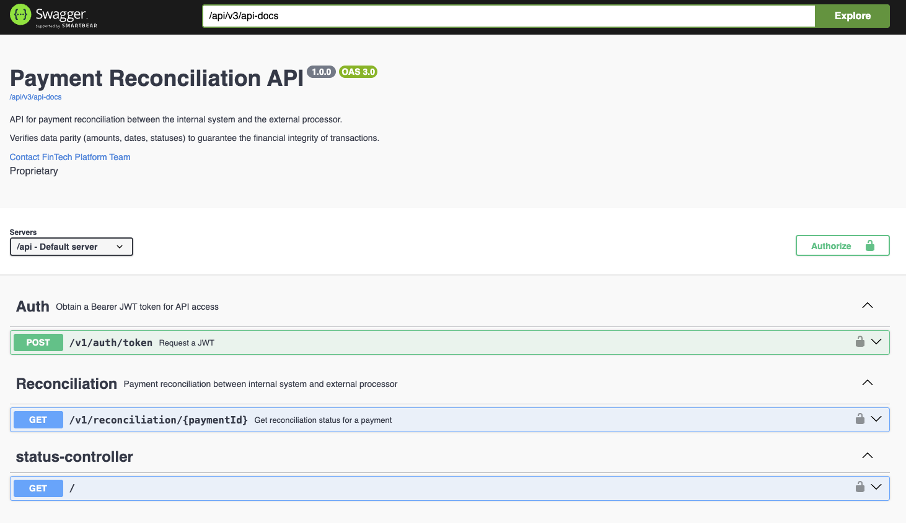

# Payment Reconciliation System

REST API that performs **3-way reconciliation** of payments across three independent sources: the internal database, a JSON/REST processor, and a legacy SOAP processor. Returns a structured result indicating whether the payment is fully reconciled or which discrepancy was detected and where.



---

## Requirements

| Tool | Minimum version | Notes |
|---|---|---|
| **Docker** | 24+ | Runs PostgreSQL and both WireMock stubs |
| **Docker Compose** | v2 (plugin) | `docker compose` — note: no dash |
| **Java** | 21 | Only needed to run tests locally or the app outside Docker |
| **jq** | any | Optional — makes `curl` output readable |

> The application itself runs fully inside Docker. Java is only required if you want to run tests or start the app from the IDE.

---

## Quick Start

```bash
# 1. Start all services (PostgreSQL + WireMock JSON + WireMock SOAP + app)
docker compose up -d

# 2. Insert demo payments into the internal database
make seed
```

That's it. The API is ready at `http://localhost:8080/api`.

### Services

| Service | Local URL | Purpose |
|---|---|---|
| **API** | http://localhost:8080/api | Spring Boot application |
| **Swagger UI** | http://localhost:8080/api/swagger-ui.html | Interactive API docs |
| **WireMock — JSON processor** | http://localhost:9091/\_\_admin/mappings | Stubs for REST payment processor |
| **WireMock — SOAP processor** | http://localhost:9092/\_\_admin/mappings | Stubs for XML/SOAP payment processor |
| **PostgreSQL** | localhost:5435 / db `payments` | Internal payment storage |


### Useful make targets

```bash
make up          # start all services
make up-db       # start only postgres + both wiremocks (run the app from IDE)
make seed        # insert demo payments
make down        # stop containers (data persists)
make down-v      # stop containers AND delete volumes
make logs-app    # tail application logs
make ps          # container status
```

---

## Authentication

All reconciliation endpoints require a **Bearer JWT token**. Obtain one with:

```bash
curl -s -X POST http://localhost:8080/api/v1/auth/token \
  -H "Content-Type: application/json" \
  -d '{"username":"admin","password":"admin123"}' | jq -r .access_token
```

Available dev credentials:

| Username | Password |
|---|---|
| `admin` | `admin123` |
| `reconciler` | `reconciler2024` |

Tokens expire after **1 hour**. Export the token to reuse it across requests:

```bash
TOKEN=$(curl -s -X POST http://localhost:8080/api/v1/auth/token \
  -H "Content-Type: application/json" \
  -d '{"username":"admin","password":"admin123"}' | jq -r .access_token)
```

---

## API Reference

### Reconcile a payment

```
GET /api/v1/reconciliation/{paymentId}
Authorization: Bearer <token>
```

**Response fields**

| Field | Type | Description |
|---|---|---|
| `paymentId` | string | Payment identifier queried |
| `status` | string | Reconciliation outcome (see table below) |
| `statusDescription` | string | Human-readable explanation of the status |
| `fullyReconciled` | boolean | `true` only when status is `CONCILIATED` |
| `discrepancies` | array | List of detected mismatches (empty when reconciled) |
| `internalPayment` | object | Snapshot from internal DB — omitted if absent |
| `processorPayment` | object | Snapshot from JSON processor — omitted if absent |
| `soapProcessorPayment` | object | Snapshot from SOAP processor — omitted if absent |
| `reconciledAt` | datetime | When this reconciliation was performed |

**Reconciliation statuses**

| Status | Meaning |
|---|---|
| `CONCILIATED` | All three sources agree (amount ±0.01, date ±5 min) |
| `DISCREPANCY_AMOUNT` | Amount differs in one or both processors |
| `DISCREPANCY_DATE` | Transaction date differs beyond the 5-minute tolerance |
| `MULTIPLE_DISCREPANCIES` | Both amount and date differ simultaneously |
| `MISSING_IN_PROCESSOR` | Payment is in the internal DB but absent in both processors |
| `MISSING_IN_JSON_PROCESSOR` | Present internally and in SOAP, missing in JSON processor |
| `MISSING_IN_SOAP_PROCESSOR` | Present internally and in JSON processor, missing in SOAP |
| `MISSING_IN_INTERNAL` | Processors have the payment but the internal DB does not |

**HTTP status codes**

| Code | Scenario |
|---|---|
| `200` | Reconciliation result returned (any status, including discrepancies) |
| `401` | Missing or invalid Bearer token |
| `404` | Payment not found in any of the three sources |
| `503` | External processor unavailable (circuit breaker open) |

---

## Example Requests

All examples assume `$TOKEN` is set as shown in the Authentication section.

### Fully reconciled

```bash
curl -s http://localhost:8080/api/v1/reconciliation/pay_abc123 \
  -H "Authorization: Bearer $TOKEN" | jq .
```

```json
{
  "paymentId": "pay_abc123",
  "status": "CONCILIATED",
  "statusDescription": "Payment matches across all three systems",
  "fullyReconciled": true,
  "discrepancies": [],
  "internalPayment":       { "paymentId": "pay_abc123", "amount": "100.00", "currency": "USD", "status": "APPROVED", "source": "INTERNAL" },
  "processorPayment":      { "paymentId": "pay_abc123", "amount": "100.00", "currency": "USD", "status": "APPROVED", "source": "PROCESSOR" },
  "soapProcessorPayment":  { "paymentId": "pay_abc123", "amount": "100.00", "currency": "USD", "status": "APPROVED", "source": "SOAP_PROCESSOR" },
  "reconciledAt": "2024-06-15T10:05:00"
}
```

### Amount discrepancy

```bash
curl -s http://localhost:8080/api/v1/reconciliation/pay_disc001 \
  -H "Authorization: Bearer $TOKEN" | jq .
```

```json
{
  "paymentId": "pay_disc001",
  "status": "DISCREPANCY_AMOUNT",
  "statusDescription": "Amount mismatch detected between sources",
  "fullyReconciled": false,
  "discrepancies": [
    {
      "type": "AMOUNT_MISMATCH",
      "field": "amount",
      "internalValue": "100.00 USD",
      "processorValue": "95.00 USD",
      "processorSource": "JSON_PROCESSOR"
    }
  ]
}
```

### Date discrepancy

```bash
curl -s http://localhost:8080/api/v1/reconciliation/pay_date001 \
  -H "Authorization: Bearer $TOKEN" | jq .
```

### Multiple discrepancies (amount + date)

```bash
curl -s http://localhost:8080/api/v1/reconciliation/pay_multi001 \
  -H "Authorization: Bearer $TOKEN" | jq .
```

### Missing in both processors

```bash
curl -s http://localhost:8080/api/v1/reconciliation/pay_missing \
  -H "Authorization: Bearer $TOKEN" | jq .
```

```json
{
  "paymentId": "pay_missing",
  "status": "MISSING_IN_PROCESSOR",
  "statusDescription": "Payment found in internal system but missing in all external processors",
  "fullyReconciled": false,
  "discrepancies": [
    { "type": "MISSING_RECORD", "field": "paymentId", "internalValue": "pay_missing" }
  ],
  "internalPayment": { "paymentId": "pay_missing", "amount": "250.00", "currency": "USD" }
}
```

### Missing in internal DB

```bash
curl -s http://localhost:8080/api/v1/reconciliation/pay_extonly \
  -H "Authorization: Bearer $TOKEN" | jq .
```

### Not found anywhere — 404

```bash
curl -s http://localhost:8080/api/v1/reconciliation/pay_ghost \
  -H "Authorization: Bearer $TOKEN" | jq .
```

```json
{
  "httpStatus": 404,
  "errorCode": "PAYMENT_NOT_FOUND",
  "message": "Payment not found in any source: pay_ghost"
}
```

---

## Demo Payment IDs

All IDs below are pre-loaded by `make seed` and stubbed in WireMock.

| Payment ID | Expected status | Scenario |
|---|---|---|
| `pay_abc123` | CONCILIATED | Nike Store, USD 100.00 |
| `pay_c001` | CONCILIATED | Starbucks, USD 50.00 |
| `pay_c002` | CONCILIATED | Amazon, EUR 199.99 |
| `pay_c003` | CONCILIATED | Delta Airlines, USD 1500.00 |
| `pay_c004` | CONCILIATED | The Fat Duck, GBP 85.00 |
| `pay_c005` | CONCILIATED | Netflix, USD 29.99 |
| `pay_disc001` | DISCREPANCY\_AMOUNT | Spotify — internal 100.00 / processor 95.00 |
| `pay_d001` | DISCREPANCY\_AMOUNT | Sysco — internal 500.00 / processor 499.50 |
| `pay_d002` | DISCREPANCY\_AMOUNT | Apple Store — internal 1200.00 / processor 1050.00 |
| `pay_d003` | DISCREPANCY\_AMOUNT | Dr. Martinez EUR — internal 75.00 / processor 82.50 |
| `pay_date001` | DISCREPANCY\_DATE | Marriott — processor timestamp +2 hours |
| `pay_dt001` | DISCREPANCY\_DATE | Hertz — processor timestamp +30 min |
| `pay_dt002` | DISCREPANCY\_DATE | Accenture — processor timestamp +1 day |
| `pay_multi001` | MULTIPLE\_DISCREPANCIES | Salesforce — amount + date differ |
| `pay_multi002` | MULTIPLE\_DISCREPANCIES | DHL Express — amount + date differ |
| `pay_missing` | MISSING\_IN\_PROCESSOR | Wire transfer — absent in both processors |
| `pay_mp001` | MISSING\_IN\_PROCESSOR | Shopify payout — absent in both processors |
| `pay_mp002` | MISSING\_IN\_PROCESSOR | Upwork freelance — absent in both processors |
| `pay_extonly` | MISSING\_IN\_INTERNAL | Amazon refund — processors have it, DB does not |
| `pay_ext001` | MISSING\_IN\_INTERNAL | Visa chargeback — processors have it, DB does not |
| `pay_ext002` | MISSING\_IN\_INTERNAL | PayPal adjustment — processors have it, DB does not |
| `pay_ghost` | 404 | Does not exist anywhere |

---

## Running Tests

Java 21 and a local Gradle installation (or the one downloaded by the wrapper) are required.

```bash
# All tests
gradle test

# Only the reconciliation service (unit, no Spring context)
gradle test --tests "*.ReconciliationServiceTest"

# Open the HTML test report
open build/reports/tests/test/index.html
```

**Test suite coverage**

| Test class | Scenarios covered |
|---|---|
| `ReconciliationServiceTest` | CONCILIATED · DISCREPANCY\_AMOUNT (JSON + SOAP) · DISCREPANCY\_DATE · MULTIPLE\_DISCREPANCIES · date tolerance · MISSING\_IN\_PROCESSOR · MISSING\_IN\_JSON\_PROCESSOR · MISSING\_IN\_SOAP\_PROCESSOR · MISSING\_IN\_INTERNAL · PaymentNotFoundException · persistence always called · no persistence on not-found |

---

## Observability

```bash
# Application health (no token required)
curl -s http://localhost:8080/api/actuator/health | jq .

# Circuit breaker state — paymentProcessor and soapProcessor
curl -s http://localhost:8080/api/actuator/circuitbreakers | jq .

# Available metrics
curl -s http://localhost:8080/api/actuator/metrics | jq .names
```

---

## Request Collections

Ready-to-import collections are in [`docs/requests/`](docs/requests/):

| File | Use with |
|---|---|
| `payment-reconciliation.postman_collection.json` | Postman — auto-fetches JWT, includes tests per request |
| `local.postman_environment.json` | Postman environment (import alongside the collection) |
| `api-examples.http` | VS Code REST Client · IntelliJ HTTP Client |

---

## Architecture

```
domain/         — pure business logic, no framework dependencies
application/    — use cases + port interfaces
infrastructure/ — REST controllers, JPA adapters, WebClient, security
```

All three external sources are fetched concurrently via `Mono.zip` (Project Reactor). Dependency direction is strictly inward: `infrastructure → application → domain`.

For architecture detail see [`docs/ARCHITECTURE.md`](docs/ARCHITECTURE.md).
For every design decision and its rationale see [`DECISIONS.md`](DECISIONS.md).

---

## Tech Stack

| Layer | Technology |
|---|---|
| Language | Java 21 |
| Framework | Spring Boot 3.2 |
| Build | Gradle 8.8 |
| Persistence | Spring Data JPA + PostgreSQL 16 + Flyway |
| HTTP client | Spring WebFlux (WebClient) |
| Resilience | Resilience4j — Circuit Breaker + Retry |
| Security | Spring Security + JJWT 0.12 (HS256) |
| XML parsing | Jackson Dataformat XML |
| Mapping | MapStruct 1.5 + Lombok |
| API docs | SpringDoc OpenAPI 3 / Swagger UI |
| Testing | JUnit 5 + Mockito |
| Dev mocks | WireMock 3.6 (two independent instances) |
| Containers | Docker + Docker Compose |
